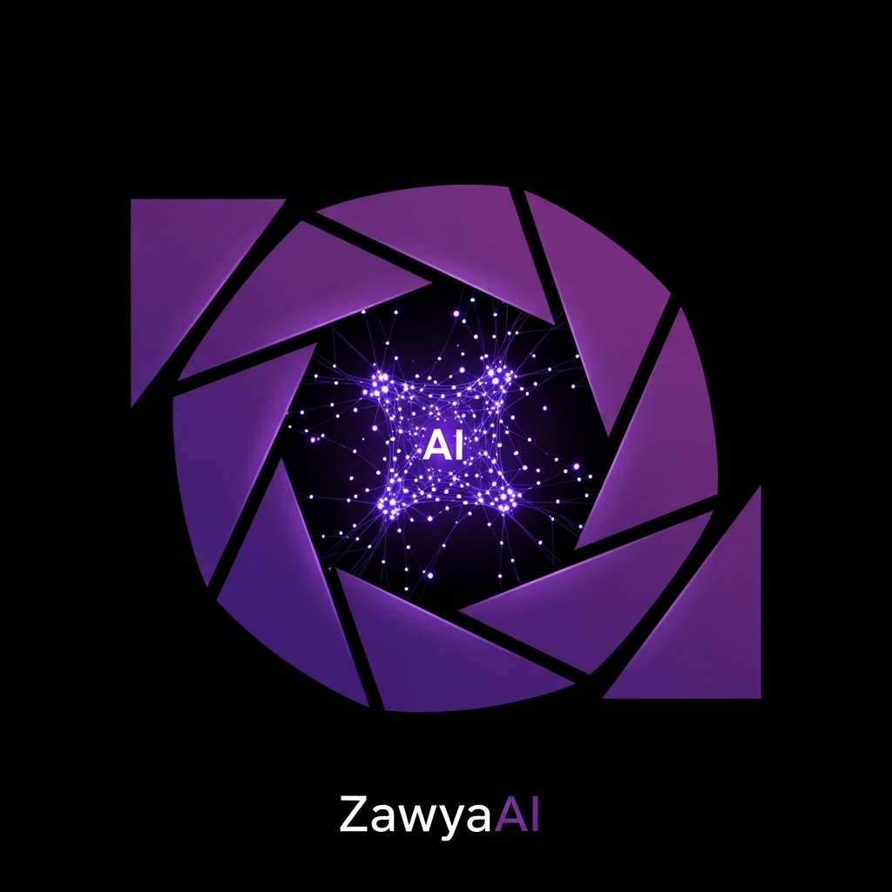

# ZawIA — Directeur Photo IA pour Créateurs de Contenu

<p align="center">
  
</p>

<p align="center">
  <strong>Application mobile de création de contenu vidéo assistée par intelligence artificielle</strong><br/>
  Développée par l'équipe de l'Université d'Oum El Bouaghi 🇩🇿
</p>

<p align="center">
  
  
  
  
  
</p>

---

## 📱 Présentation

**ZawIA** est une application mobile qui transforme votre smartphone en studio de production cinématographique. Grâce à l'IA Claude Opus 4.5 d'Anthropic, elle analyse en temps réel votre cadrage, votre exposition et votre composition pour vous guider vers des prises de vue parfaites — adaptées à chaque plateforme sociale.

> **APK de démonstration** : [Télécharger](https://expo.dev/artifacts/eas/wKPrMykiGaJzXzjRvvQdta.apk)  
> **API Backend** : [https://zawai-app.onrender.com](https://zawai-app.onrender.com)

---

## ✨ Fonctionnalités

### 🎥 Caméra IA en Temps Réel
- Analyse de la composition (règle des tiers, cadrage, angle)
- Analyse de l'exposition (ISO, vitesse d'obturation, balance des blancs)
- Détection du type de plan (gros plan, plan large, top shot, etc.)
- Score de qualité global mis à jour toutes les 2 secondes
- Conseils du "DOP IA" (Directeur de la Photographie) affichés en direct
- Stabilité de la caméra via gyroscope
- Grille de composition activable
- Modes Photo et Vidéo (jusqu'à 60 secondes)

### 🎬 Studio IA (8 outils)
| Outil | Description |
|-------|-------------|
| **Générateur de scénarios** | Crée des scripts créatifs adaptés à votre contenu |
| **Générateur de légendes** | Génère des légendes optimisées par plateforme |
| **Analyse de photos** | Analyse détaillée de vos images avec recommandations |
| **Planificateur de contenu** | Planifie votre calendrier éditorial |
| **Support IA** | Assistant conversationnel pour vos questions |
| **Conseils créatifs** | Idées et inspirations personnalisées |
| **Score viral** | Évalue le potentiel viral de votre contenu |
| **Collaboration** | Outils de travail en équipe |

### 📤 Publication Multi-Plateformes
- Publication simultanée sur **Instagram**, **TikTok**, **Snapchat**, **YouTube Shorts**, **Facebook**, **X (Twitter)**
- Génération de légendes IA par plateforme
- Hashtags suggérés automatiquement
- Étalonnage cinématographique (LUTs) avec aperçu en direct
- Sélection automatique de l'heure optimale de publication
- Historique des publications

### 🎨 Étalonnage Cinéma (LUTs)
- Plusieurs profils cinématographiques (Teal & Orange, Cinematic, etc.)
- Sélection automatique par IA selon le contenu
- Plans Pro et Studio avec LUTs exclusifs
- Aperçu en temps réel sur la photo capturée

### 🔧 Autres Fonctionnalités
- **Directeur IA** — Suggestions de mise en scène avancées
- **Light Coach** — Conseils d'éclairage personnalisés
- **Auto-Cut** — Montage automatique
- **LUT Auto** — Étalonnage automatique
- **Shot Analyser** — Analyse de plan détaillée
- **Watermark** — Filigrane personnalisé
- **Tracking** — Suivi de performance
- **Analytics** — Statistiques détaillées
- **Export PDF** — Export de rapports
- **Galerie** — Gestion des médias
- **Profil & Paramètres** — Personnalisation complète
- **Onboarding** — Guide de démarrage

### 💳 Monétisation (Plans)
| Plan | Prix | Fonctionnalités |
|------|------|-----------------|
| **Gratuit** | 0 DA | 10 analyses IA/jour, fonctionnalités de base |
| **Pro** | 500 DA/mois | Analyses illimitées, export PDF, sans pub |
| **Studio** | 1 500 DA/mois | Tout Pro + collaboration, stats avancées, publication auto |

Paiement via **BaridiMob** (CCP / Edahabia) ou **Chargily Pay**.

---

## 🏗️ Architecture

```
Zawya-AI-Studio/
├── artifacts/
│   ├── zawyaai/          # Application mobile React Native / Expo
│   │   ├── app/          # Écrans (Expo Router)
│   │   ├── components/   # Composants réutilisables
│   │   ├── lib/          # Logique métier & appels API
│   │   │   └── ai/       # Modules IA (exposition, composition, stabilité, score)
│   │   └── contexts/     # Contextes React (Auth, History)
│   └── api-server/       # Serveur API Express 5
│       └── routes/       # Routes REST
├── zawia-api-standalone/ # Version standalone de l'API
├── lib/
│   └── api-spec/         # Spécification OpenAPI
└── packages/
    ├── db/               # Schéma PostgreSQL + Drizzle ORM
    └── api-zod/          # Schémas de validation Zod
```

### Stack Technique

**Mobile**
- React Native + Expo SDK
- Expo Router (navigation par fichiers)
- TypeScript
- expo-camera (caméra + micro)
- expo-linear-gradient
- AsyncStorage

**Backend**
- Node.js 24 + Express 5
- TypeScript + esbuild
- PostgreSQL + Drizzle ORM
- Zod (validation)
- Pino (logs)
- Déployé sur **Render**

**Intelligence Artificielle**
- Anthropic Claude Opus 4.5
- Analyse de frames caméra (vision)
- Génération de texte (scénarios, légendes, conseils)

---

## 🚀 Installation & Démarrage

### Prérequis
- Node.js 24+
- pnpm
- Expo CLI (`npm install -g expo-cli`)
- Compte Expo (pour les builds EAS)

### 1. Cloner le projet

```bash
git clone <url-du-repo>
cd Zawya-AI-Studio
```

### 2. Installer les dépendances

```bash
pnpm install
```

### 3. Configurer les variables d'environnement

**API Server** (`artifacts/api-server/.env`) :
```env
PORT=3000
AI_INTEGRATIONS_ANTHROPIC_API_KEY=sk-ant-api03-...
TIKTOK_CLIENT_KEY=your_tiktok_client_key
TIKTOK_CLIENT_SECRET=your_tiktok_client_secret
FACEBOOK_APP_ID=your_facebook_app_id
FACEBOOK_APP_SECRET=your_facebook_app_secret
CHARGILY_PUBLIC_KEY=test_pk_...
CHARGILY_SECRET_KEY=test_sk_...
```

**Application mobile** (`artifacts/zawyaai/.env`) :
```env
EXPO_PUBLIC_API_URL=https://zawai-app.onrender.com
```

### 4. Lancer le serveur API

```bash
pnpm --filter @workspace/api-server run dev
```

### 5. Lancer l'application mobile

```bash
cd artifacts/zawyaai
npx expo start
```

Scannez le QR code avec l'application **Expo Go** sur votre téléphone.

### 6. Générer un APK Android

```bash
cd artifacts/zawyaai
eas build --platform android --profile preview
```

---

## 🔌 API Endpoints

Base URL : `https://zawai-app.onrender.com`

| Méthode | Route | Description |
|---------|-------|-------------|
| `GET` | `/` | Informations sur l'API |
| `GET` | `/api/health` | Santé du serveur |
| `POST` | `/api/scenarios/generate` | Génération de scénarios |
| `POST` | `/api/captions/generate` | Génération de légendes |
| `POST` | `/api/support/chat` | Support IA conversationnel |
| `POST` | `/api/tips/generate` | Conseils créatifs |
| `POST` | `/api/analyze/photo` | Analyse de photo |
| `POST` | `/api/analyze/frame` | Analyse caméra temps réel |
| `POST` | `/auth/tiktok/token` | OAuth TikTok |
| `POST` | `/auth/facebook/token` | OAuth Facebook |
| `POST` | `/auth/instagram/token` | OAuth Instagram |

---

## 📋 Commandes Utiles

```bash
# Vérification TypeScript (tous les packages)
pnpm run typecheck

# Build complet
pnpm run build

# Régénérer les hooks API depuis la spec OpenAPI
pnpm --filter @workspace/api-spec run codegen

# Pousser les changements de schéma DB (dev uniquement)
pnpm --filter @workspace/db run push

# Lancer l'API en local
pnpm --filter @workspace/api-server run dev
```

---

## 🔐 Authentification Sociale

| Plateforme | Statut |
|------------|--------|
| TikTok | ⏳ En attente d'approbation (7-14 jours) |
| Facebook | ⚠️ Clés API à configurer |
| Instagram | ⚠️ Clés API à configurer |
| Google | ✅ Client ID configuré |

---

## 💳 Paiement Algérien

L'application supporte deux passerelles de paiement locales :

- **BaridiMob** — Service officiel d'Algérie Poste (CCP + Edahabia), frais 2%
- **Chargily Pay** — Alternative moderne, frais 2.5%, documentation complète

Voir [GUIDE-PAIEMENT-CCP.md](GUIDE-PAIEMENT-CCP.md) pour les instructions d'intégration détaillées.

---

## 🗺️ Feuille de Route

- [x] Interface caméra avec analyse IA temps réel
- [x] Studio IA avec 8 outils
- [x] Publication multi-plateformes
- [x] Étalonnage cinématographique (LUTs)
- [x] API backend déployée
- [ ] Authentification sociale (TikTok, Facebook, Instagram)
- [ ] Intégration paiement CCP
- [ ] Publication automatique via API Meta & TikTok
- [ ] Modèle IA local TFLite (offline)

---

## 👥 Équipe

Projet développé à l'**Université d'Oum El Bouaghi**, Algérie.

---

## 📄 Licence

Tous droits réservés © 2026 ZawIA. Voir [terms](artifacts/zawyaai/app/terms.tsx) pour les conditions d'utilisation.
